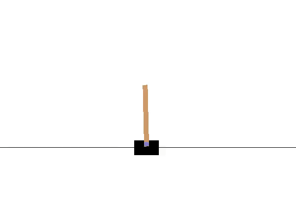

# CartPole-v0 Reinforcement Lerning
It is tensorflow implementation of  Actor-Critic Method. 

## Introduction 
A pole is attached by an un-actuated joint to a cart, which moves along a frictionless track. The system is controlled by applying a force of +1 or -1 to the cart. The pendulum starts upright, and the goal is to prevent it from falling over. A reward of +1 is provided for every timestep that the pole remains upright. The episode ends when the pole is more than 15 degrees from vertical, or the cart moves more than 2.4 units from the center.

```python
pip install gym

```
### Before Training


### After Training

